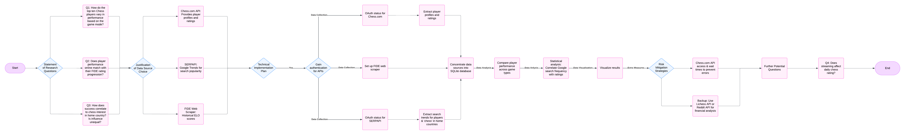

# In-Chess-tigation - Evaluating Top Chess Player's Performance and Influence

**Authors:** 
- Pritish Raj 
- Defne Ece Yavuz
- Coleman Cochran 

This project analyzes the performance trends of the top ten chess players using data from Chess.com, Google Trends, and FIDE. It includes **data collection**, **processing**, and **visualization** to answer critical questions about player performance and influence.

---

## **Research Questions**
- **How do the top ten chess players vary in performance across different game modes?**  
- **Does player performance online align with their FIDE rating progression over time?**  
- **How does their success correlate with chess interest in their home country? Are certain players more influential than others?**

---

## **Justification of Data Sources**
- **[Chess.com API](https://www.chess.com/news/view/published-data-api)**: Provides player profiles, game statistics (blitz, rapid, standard ratings), and tournament performances.  
- **[SERPAPI (Google Trends)](https://serpapi.com/dashboard)**: Supplies keyword popularity time series data, focusing on public interest in chess players and chess-related terms via Google Trends.  
- **[FIDE Web Scraper](https://github.com/xRuiAlves/fide-ratings-scraper/tree/master#api-documentation)**: Offers historical ELO ratings to track long-term player performance trends.

---

## **Technical Implementation Plan**
1. **Gain Authentication for APIs**:  
   - Obtain OAuth access for Chess.com and SERPAPI.  
   - Set up FIDE web scraper for historical data extraction.  

2. **Extract Data**:  
   - Retrieve player profiles, including blitz, rapid, standard, and FIDE ratings, from Chess.com.  
   - Use SERPAPI to gather Google Trends data for players and "chess" in their home countries.  
   - Scrape historical FIDE rankings to track rating progression over time.

3. **Data Integration**:  
   - Store all datasets in a SQLite database for analysis.  

4. **Analyze and Visualize Data**:  
   - Compare player performance across game modes.  
   - Correlate public search interest with player ratings. 
   - Create graphs and visualizations to present findings.

---

## **Risk Mitigation Strategies**
- **Avoiding API Rate-Limit Errors**:  
  - All team members have API access to distribute load.  
  - Implement request throttling to prevent 429 errors.  

- **Backup Plans**:  
  - **Lichess API**: Alternative source for player profiles and game statistics.  
  - **Financial Analysis Alternative**: Use Reddit and Google Trends APIs to explore correlations between trending financial topics and public interest.

---

## **Future Extensions**
- Investigate the impact of Twitch streaming (e.g., Magnus Carlsen, Hikaru Nakamura) on player ratings using the Twitch API.  
- Study correlations between streaming hours and performance metrics.

---

## **Work Distribution Strategy**
- **Phase 1: Data Collection** – Divide API setup and data retrieval tasks.  
- **Phase 2: Data Analysis** – Assign statistical tests and trend correlation tasks based on expertise.  
- **Phase 3: Data Visualization** – Share responsibility for creating visualizations and graphs.

## **Intended Progression** 

DRAFT (things to include):

Table of Contents
| No | Section | Content |
| :--: | :--: | :--: |
| 1 | [Background Info]() |  |
| 2 | [RQ and Hypotheses]() |  |
| 3 | [Data Sources]() |  |

---

<u> Background Information/Key Terms: </u>
Chess: is this worth defining?
FIDE: International Chess Federation
ELO:
Game Variations:
- Standard:
- Rapid:
- Blitz:
Over-the-board:
Online chess:

---

<u> Research Question: </u>

<u> Hypotheses </u>
H0: 
H1:

---

Data Sources:
- **[Chess.com API](https://www.chess.com/news/view/published-data-api)**: Provides player profiles, game statistics (blitz, rapid, standard ratings), and tournament performances.  
- **[SERPAPI (Google Trends)](https://serpapi.com/dashboard)**: Supplies keyword popularity time series data, focusing on public interest in chess players and chess-related terms via Google Trends.  
- **[FIDE Web Scraper](https://github.com/xRuiAlves/fide-ratings-scraper/tree/master#api-documentation)**: Offers historical ELO ratings to track long-term player performance trends.

---

Methodology:
1)
2)
3)
4)
5)

---

Order of Notebooks
| No | Name | Content |
| :--: | :--: | :--: |
| 01 | Data Collection |  |
| 02 | Data Processing |  |
| 03 | Data Analysis |  |
| 04 | Data Visualisation |  |

---

Limitations/Considerations/Risk Mitigation:

---

Work Distribution Strategy:

---

Use of AI: (if we want to include our convos with ChatGPT/chatbots)