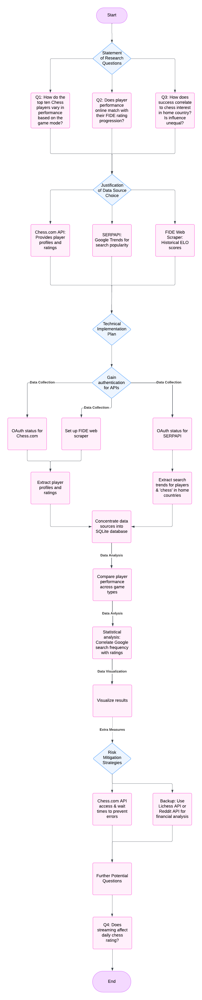

# In-Chess-tigation - Evaluating Top Chess Players' Performance and Influence

**Authors:** 
- Pritish Raj 
- Defne Ece Yavuz
- Coleman Cochran 

This project analyzes the performance trends of the top ten chess players using data from Chess.com, Google Trends, and FIDE. It includes **data collection**, **processing**, and **visualization** to answer critical questions about player performance and influence.

---
## README Table of Contents
| No | Heading |
| :--: | :--: |
| [Section 1: Introduction](#section-1-introduction) |
| 1 | [Key Terms](#key-terms) |
| 2 | [Research Questions](#research-questions) |
| 3 | [Order of Notebooks](#order-of-notebooks) |
| 4 | [Justification of Data Sources](#justification-of-data-sources) |
| [Section 2: Pre-Research](#section-2-pre-research) |  |
| 5 | [Technical Implementation Plan](#technical-implementation-plan) |
| 6 | [Risk Mitigation Strategies](#risk-mitigation-strategies) |
| 7 | [Work Distribution Strategy](#work-distribution-strategy) |
| 8 | [Intended Workflow Flowchart](#intended-progression) |
| [Section 3: Post-Research and Replication](#section-3-post-research-and-replication) |  |
| 9 | [Methodology](#methodology) |
| 10 | [Future Extensions](#future-extensions) |
| 11 | [Recreating the virtual environment, replicating the code and results](#recreating-the-environment-running-the-code-and-replicating-the-results) |
| 12 | [Use of AI](#-use-of-ai) |

---
# Section 1: Introduction

## Key Terms:
**Chess:** Game

**FIDE:** International Chess Federation

**Elo:** Chess rating system, used by FIDE and most chess websites and organizations

**Chess Game Modes:** 

- **Standard:** A standard FIDE chess game typically lasts around four hours with a time control of 90 minutes for the first 40 moves, followed by 30 minutes for the rest of the game, with an additional 30 seconds added per move; meaning a game can potentially go much longer depending on the complexity of the positions and number of moves played. 

- **Rapid:** A FIDE rapid chess game typically has a time control of 15 minutes per player with a 10-second increment per move; meaning each player gets 15 minutes to play their moves, and they receive an additional 10 seconds added to their clock after each move they make. 

- **Blitz:** A FIDE blitz game is typically played with a time control of 3 minutes per player with a 2-second increment per move; essentially meaning each player has 3 minutes to make their moves, with an additional 2 seconds added to their clock after each move is made. 

**Over-the-board:** A game of chess which is played in person over a physical board.

**Online chess:** A game of chess which is played on line. For instance, on Chess.com 

---

## Research Questions
Our main goal with this research was to see how chess players' performances changed in different conditions (i.e., game mode, time, in-person vs. online), and how their performance (good or bad) influenced national social trends. To investigate this, we came up with three main research questions to lead our exploratory analysis and act as a starting point:

- **Question 1:** How do the top ten chess players vary in performance across different game modes?

- **Question 2:** Does player performance online align with their FIDE rating?

- **Question 3:** How does their success correlate with chess interest in their home country? Are certain players more influential than others?

---

## Order of Notebooks
| No | Name | Content |
| :--: | :--: | :--: |
| 01 | [Data Collection](./notebooks/NB01-Data-Collection.ipynb) | Code used to collect FIDE, Chess.com, and Google Trends Data |
| 02 | [Data Processing](./notebooks/NB02-Data-Processing.ipynb) | Cleaning, creating an SQL database, and initial data exploration |
| 03 | [Data Analysis](./notebooks/NB03-Data-Analysis.ipynb) | Exploratory data analysis and visualisations |
| 04 | [Data Visualization](./notebooks/NB04-Data-Visualization_1.ipynb) | Visualizing Google Trends data |
| 05 | [Data Visualization 2](./notebooks/NB05-Data-Visualization_2.ipynb)| Visualizing Google Trends and FIDE data combined |

---

## Justification of Data Sources
- **[Chess.com API](https://www.chess.com/news/view/published-data-api)**: Provides player profiles, game statistics (blitz, rapid, standard ratings), and tournament performances.  
- **[SERPAPI (Google Trends)](https://serpapi.com/dashboard)**: Supplies keyword popularity time series data, focusing on public interest in chess players and chess-related terms via Google Trends.  
- **[FIDE Web Scraper](https://github.com/xRuiAlves/fide-ratings-scraper/tree/master#api-documentation)**: Offers historical ELO ratings to track long-term player performance trends.

---

# Section 2: Pre-Research

## Technical Implementation Plan
1. **Gain Authentication for APIs**:  
   - Obtain OAuth access for Chess.com and SERPAPI.  
   - Set up FIDE web scraper for historical data extraction.  

2. **Extract Data**:  
   - Retrieve player profiles, including blitz, rapid, standard, and FIDE ratings, from Chess.com.  
   - Use SERPAPI to gather Google Trends data for players and "chess" in their home countries.  
   - Scrape historical FIDE rankings to track rating progression over time.

3. **Data Integration**:  
   - Store all datasets in a SQLite database for analysis.  

4. **Analyze and Visualize Data**:  
   - Compare player performance across game modes.  
   - Correlate public search interest with player ratings. 
   - Create graphs and visualizations to present findings.

---

## Risk Mitigation Strategies
- **Avoiding API Rate-Limit Errors**:  
  - All team members have API access to distribute load.  
  - Implement request throttling to prevent 429 errors.  

- **Backup Plans**:  
  - **Lichess API**: Alternative source for player profiles and game statistics.  
  - **Financial Analysis Alternative**: Use Reddit and Google Trends APIs to explore correlations between trending financial topics and public interest.

---

## Work Distribution Strategy
- **Phase 1: Data Collection** – Divide API setup and data retrieval tasks.
   - <u> Pritish:</u>  Google Trends and FIDE
   - <u> Defne:</u>  Chess.com and FIDE
   - <u> Coleman:</u>  Google Trends and FIDE
- **Phase 2: Data Analysis** – Assign statistical tests and trend correlation tasks based on expertise.  
- **Phase 3: Data Visualization** – Share responsibility for creating visualizations and graphs.

## Intended Progression

---
# Section 3: Post-Research and Replication

## Methodology:
1) Define a dataframe of the current, active, global top 10 chess players
2) Configure and use the FIDE Ratings Scraper to collect the classic, rapid, and blitz over-the-board data of the 10 players, convert it into a pandas dataframe and save as a CSV
3) Obtain current Chess.com ratings of the players through the public Chess.com API, convert it into a pandas dataframe and save as a CSV
4) Obtain Google Trends data for the search words "chess" and "[player name]" in players' federation countries (e.g., Magnus Carlsen plays for the Norwegian Chess federation, so his trend data will be collectd from Norway) using SERPAPI
5) Process and combine the data into an SQL database
6) Perform exploratory analysis and visualize the results through appropriate plots

---

## Future Extensions
- Investigate the impact of Twitch streaming (e.g., Magnus Carlsen, Hikaru Nakamura) on player ratings using the Twitch API.  
- Study correlations between streaming hours and performance metrics.

---

## Recreating the environment, running the code and replicating the results

### How to recreate the Python environment

1) Install pyenv through running 

<pre> brew install pyenv </pre> (for Mac) or 

<pre> curl https://pyenv.run </pre>| bash (for Linux)

2) Install the required Python version by running 

<pre> pyenv install 3.12.2 </pre> 

and then 

<pre> pyenv local 3.12.2 </pre>

3) To create and activate the virtual environment, run 

<pre> python -m venv venv </pre> 

and then 

<pre> source venv/bin/activate </pre> for Mac/Linux and 

<pre>.\venv\Scripts\activate </pre> for Windows

4) Instal requirements.txt. Run the following: 

<pre> pip install -r requirements.txt </pre>

where requirements.txt is a document containing all the required libraries (e.g., pandas) and the versions to be used

5) Install NodeJS: Past the following into your terminal
<pre>curl -fsSL https://fnm.vercel.app/install | bash
exec $SHELL
fnm install --lts
</pre>

6) Download the FIDE Scraper: Run the following code in your terminal 
<pre> npm install -g fide-ratings-scraper </pre>

If that doesn’t work run the following command:

<pre> conda activate <your_environment_name> npm i -g fide-ratings-scraper </pre>

7) Set up SERPAPI account: This will require setting up an account and creating an API key (see links below)

---

### Extra Information regarding the APIs
- Setting up FIDE Web Scraper (https://github.com/xRuiAlves/fide-ratings-scraper) 
- Getting SERPAPI authentication (https://serpapi.com/)
- Using Chess.com API (https://www.chess.com/news/view/published-data-api)

---

### How to run the code to replicate the results
To run the code as intended (to replicate the results):

1) Install the required dependencies by running pip install -r requirements.txt
2) Activate the Python environment, as described above, by running source venv/bin/activate
3) Run the Notebooks, starting from NB01, then NB02, and finally NB03

---

### 🤖 Use of AI:
We used the AI chatbot ChatGPT to work through some errors and problems in our code, additionally using it to generate AI images.